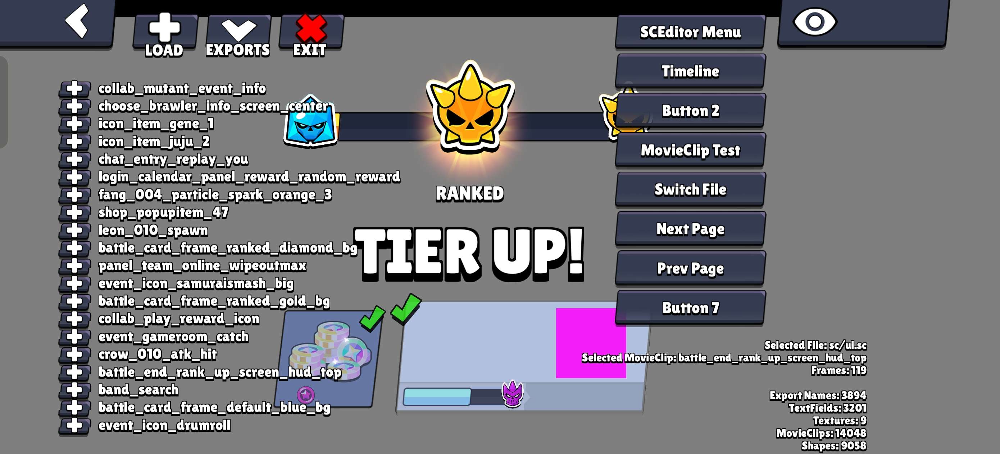

# Native SC-Editor

[SC-Editor](https://github.com/danila-schelkov/sc-editor) that runs in Brawl Stars at runtime!

# Why?
Why not? ¯\\\_(ツ)\_/¯ (S.B will kill me)

# Features
- Viewing .sc files directly from the game assets
- Pan & Zoom
- WIP Timeline

# How To Use & Requirements
1. Use your brain!
2. `npm install`

# TODO
- Better Timeline (slider)
- Viewing timelineChildrens
- Better UI
- Loading .sc files from phone storage
- Hide UI using home button
- Scroll Area on exports list

# Additional Info
- Made in laser@66.263 (arm64)
- kinda vibecoded in some days
- due to lack of motivation i will not be maintaining this project constantly

# Credits
- [SC-Editor](https://github.com/danila-schelkov/sc-editor)
- [Frida **17**](https://frida.re/)
- UI made by graphik - Discord: @graphik23 (802169687542726719)
